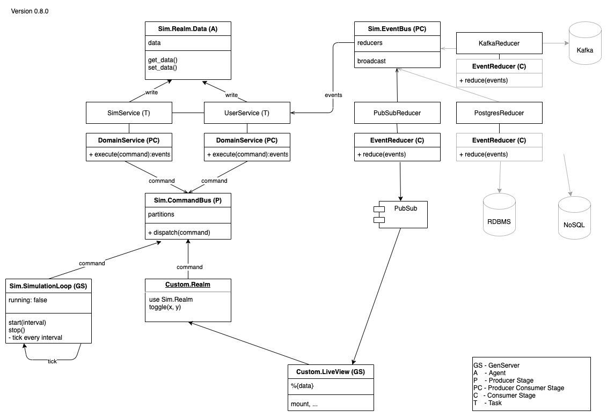

# Sim



## Components Overview

- The **Custom.Realm** module acts as an entry point. It provides an API to convert incoming requests to commands. A command has the form of `{:context, :name, args}`. For example a function call `toggle(2, 3)` could be mapped to a command `{:user, :toggle, x: 2, y: 3}`

- **Sim.Realm.SimulationLoop**: Has a recurring tick when the simulation is running, that will trigger a _sim command_.

- The **Sim.Realm.CommandBus** receives all the commands and will group them according to the given context mapping into execution groups. Each group will be forwarded their events defined in the **context** of the event. Each group will execute their events independent from the other ones. Groups should therfore execute commands that don't interfere with each other. For example, one group can simulate the growth of the vegetation, while the other group executes user movements. These two calculations can be done in parallel as they change completely different data.

- **Commands** are executed in **Domain Services**. They do the actual domain logic on the aggregate/data. In the end, they return an array of events, representing the made changes.
  While the events are then used for side effects like changing the data in a database in the next steps, the changes done during calculation are applied to data in memory (**Sim.Data**) immediately. Like that the next execution of the same group will have the latest changes and will not for example simulate the same state twice or move to the same field twice, just because the data may not have been updated in time.

- The **EventBus** receives a list of _events_ and/or _commands_ that happened in the services. It will send commands to the _CommandBus_, while events will be broadcasted via each EventReducer.

- The **EventReducers** save the events to the database, a message broker or publish them via a PubSub component.

- **Sim.Realm.Data**: holds the data. This part is the most robust one, the data will still be available even if the other parts like the command bus or the simulation loop would crash.

## Usage

### Application

Example configuration:

- Map your domain services and define how many instances can run in parallel.
- Define your reducers to whom the events should be sent.

```elixir
{Sim.Realm.Supervisor,
  name: MyApp,
  domain_services: [
    {MyService, partition: :my_service, max_demand: 5},
    {OtherService, partition: :other_service, max_demand: 1}
  ],
  reducers: [MyApp.PubSubReducer]
}
```

### Context

```elixir
defmodule MyApp do
  use Sim.Realm, app_module: __MODULE__

  def move(id, to: position) do
    send_command(:my_service, :move, id: id, to: position)
  end
end
```

### Domain Service

```elixir
defmodule MyService do
  use Sim.Commands.DataHelpers, app_module: MyApp

  def execute(:move, id: id, to: {x, y}) do
    get_data() |> move(id, x, y) |> set_data()
    [:moved, id: id, x: x, y: y]
  end
end
```

### EventReducer

```elixir
defmodule MyApp.PubSubReducer do
  def reduce(events) do
    Enum.map(events, fn event ->
      Phoenix.PubSub.broadcast(MyApp.PubSub, "MyApp", event)
    end)
  end
end
```

## Data Access

The `Sim.Commands.DataHelpers` provides some common functions to interact with the data.

`get_data` helpers for getting data and `set_data` helpers for setting data.

This is the simplest way `get_data() |> do_something() |> set_data()`.

`change_data(change_function)` is just a short form for the line above.

```elixir
def execute(:move, id: id, to: {x, y}) do
  change_data(fn data ->
    move(data, id, x, y)
  end)
  [:moved, id: id, x: x, y: y]
end
```

At this point is worth paying attention by whom the code is executed.
`get_data` and `set_data` is executed by the Data agent, while changing the data itself is executed by the domain services.

While the Data agent makes sure get and set operations are executed in isolation, it does not prevent services to override data to each other or work with outdated data, because the data changed between getting them and setting them back.

One way is to define your domain services along your data, one service per data partition.
`get_data(func)`and `set_data(func)` provide functions to extract only the parts of the data you need.
If you model your services like that, make sure to set `max_demand` to 1 for such services, so that only one service instance interacts with the given partition at the time.

```elixir
defmodule MapService do
  use Sim.Commands.DataHelpers, app_module: MyApp

  def execute(:move, id: id, to: {x, y}) do
    map = get_data(&get_map(&1))
    # or better to relieve the data agent
    map = get_data() |> get_map()

    new_map = move(map, id, x, y)
    set_data(&set_map(&1, new_map))
    [:moved, id: id, x: x, y: y]
  end

  def get_map(data) do
    get_in(data, [:path, :to, :map])
  end

  def set_map(data, map) do
    update_in(data, [:path, :to, :map], fn _ -> map end)
  end
end
```

Another way is to work with changes instead of replacing the whole data.
The calculation of the change is done in the domain service and then applied in the Data agent.
But also here be aware, that the data could change between getting and setting them.

```elixir
defmodule CounterService do
  use Sim.Commands.DataHelpers, app_module: MyApp

  def execute(:inc, []) do
    new_users = get_data() |> get_in([:path, :to, :new_users]) |> Enum.count()
    set_data(&update_in(&1, [:path, :to, :counter], &(&1 + new_users))
    [:counter_changed, by: new_users]
  end
end
```

### Feedback

`Data.update(func)` and the `update_data(func)` helpers provide also options to work with feedback.
Let's suppose that you can not move to a position on a map, if it has already been occupied in the meantime. In this case you may want to return an error.
The update function expects a tuple of `{:ok, new_data}`, `{:ok, new_data, events}` or `{:error, reason}`.
Note that the update function receives the recent data at the time the update is executed, not the data received with `get_data` in the service.

```elixir
defmodule MyService do
  use Sim.Commands.DataHelpers, app_module: MyApp

  def execute(:move, id: id, to: {x, y}) do
    with {:ok, change} = get_data() |> check_move(id, x, y) do
      case update_data(&apply_move(&1, change)) do
        :ok -> [:moved, id: id, to: {x, y}]
        {:ok, events} -> events
        {:error, reason} -> [:move_failed, :id, id, reason: reason]
      end
    else
      {:error, reason} -> [:move_failed, :id, id, reason: reason]
    end
  end

  # executed by service
  def check_move(data, id, x, y) do
    if move_allowed?(x, y), do: {:ok, id, x, y}, else: {:error, "move not allowed"}
  end

  # executed by Data
  def apply_move(data, {id, x, y}) do
    case get_in(data, [:path, :to, :map, x, y]) do
      nil -> {:ok, update_in(data, [:path, :to, :map, x, y], id)}
      _ -> {:error, "already occupied"}
    end
  end
end
```

The helper function `change_data(change_func, update_func)` let's you write it even more compact.
It expects the change function to return a tuple `{:ok, change}`.
The change is then passed to the update_function, everything else is returned directly back.

```elixir
def execute(:move, id: id, to: {x, y}) do
  case change_data(&check_move(&1, id, x, y), &apply_move(&1, &2)) do
    :ok -> [:moved, id: id, to: {x, y}]
    {:ok, events} -> events
    {:error, reason} -> [:move_failed, :id, id, reason: reason]
  end
end
```

Please keep in mind that services are designed to do the heavy and risky work.
Each service spwans a processs and if it fails or crashes, it does not effect any other processes.
While Data is meant to be robust and should therefore only consist of simple getters and setters.
In other words `check_move` in our example should do the haevy calculation, while `apply_move` should be as simple as possible.
